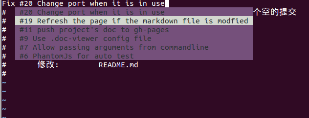

# issue-complete

Auto completion for github/gitlab issues when editing git commit messages using vim

## Usage

- `:UpdateIssue` to update issue cache
- `<C+X> <C+O>` to show omini completion, it will fetch automatically if cache is not found 

## Install

### Manually

- copy `ftdetect` and `ftplugin` to your `~/vim` folder.
- add `cache` folder to `.gitignore` in your project folder, because it will save issues in that folder. ( It will be fixed in the future ) 

### Plugin manager

TODO: I haven't use any plugin manager yet

## Road map

- [x] get current repo information by reading file in .git folder
- [x] make api calls to github to get the issue list
- [x] cache issues and add command for fetch
- [x] omni completion for file type `COMMIT_EDITMSG`
- [ ] allow filter issues in the command, currently only open issue are fetched
- [ ] allow search issues
- [ ] support Chinese
- [ ] add it to auto completion when type `Fix #` it will pop up recent issues  

## Ref

- https://github.com/JarrodCTaylor/vim-plugin-starter-kit
- http://vimdoc.sourceforge.net/htmldoc/if_pyth.html  The python interface for vim
